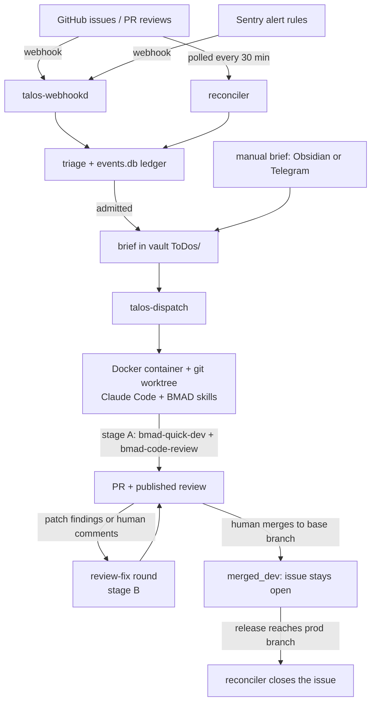

# talos-bug-automata

[](LICENSE)
[](pyproject.toml)

A self-hosted harness that turns GitHub issues and Sentry errors into reviewed
pull requests, by running Claude Code headless inside hardened Docker
containers.

> Named after Talos, the bronze automaton that walked the shores of Crete
> three times a day and dealt with whatever came ashore.

## What it does

GitHub issues and Sentry alerts arrive by webhook. A reconciler also polls
GitHub on a timer, so a dead tunnel or a dropped delivery does not lose work.
Each event goes through triage (dedupe, filters, caps). An admitted event
becomes a Markdown **brief**. A dispatcher runs each brief with Claude Code
inside a Docker container, in a git worktree of its own, and the agent opens a
PR and publishes a code review on it. Review comments start review-fix rounds.
A human merges the PR. When the merge commit reaches the production branch,
the harness closes the issue.

The same dispatcher also runs **manual briefs**. These are Markdown files with
front matter that you write in an Obsidian vault or create from Telegram.
Briefs that succeed move to `projects/{project}/completed/`. The agent's
per-project memory lives in the vault too.

You control it from a Telegram bot. The bot runs passes, shows the queue and
the event ledger, pauses everything, and retries or backfills work.

**Why:** most bug reports are small, well-scoped fixes that sit in a backlog.
This harness gives the first pass to an agent, keeps a human on every merge,
and limits how much the agent can touch.

## How it works



- **Stage A** (`issue-fix`) implements the fix with BMAD's `bmad-quick-dev`,
  opens the PR, and publishes a review of it with `bmad-code-review`. It opens
  one inline thread per finding and does not fix its own findings.
- **Stage B** (`review-fix`) runs in a fresh container with clean context. It
  fixes the `patch` findings and human comments, and replies to each thread
  with `Fixed in <sha>`.
- **Nothing merges automatically.** Issues close only when the reconciler has
  evidence that the merge commit is in the production branch.

See [docs/event-harness.md](docs/event-harness.md) for the full lifecycle.

## Features

- GitHub issue and Sentry `event_alert` intake. Signatures are verified and
  every delivery is archived for replay.
- A reconciler that polls GitHub, so the GitHub half works with no public
  ingress.
- Admission control: backlog cutoff (`activated_at`), per-issue opt-out
  label, open-PR cap, daily caps, cooldown, and review-round cap.
- Hardened containers for pipelines driven by external input. They get no SSH
  key, a throwaway `~/.claude`, a per-run git worktree, a git config
  allowlist, and no host-file inlining.
- A dry-run mode per repo. It writes draft briefs that nothing executes, so you
  can check triage before any container starts.
- Issue lifecycle labels (`ai-in-review`, `ai-merged-dev`, `ai-released`) and
  closing on merge to prod, including git-flow repos.
- Manual briefs with priorities, mono-repo and multi-repo PRs, an optional
  multi-agent swarm (architect, devs, QA, reviewer, GitHub ops), and
  persistent per-project memory.
- Telegram control panel with a kill switch.

## Built on

- [Claude Code](https://docs.anthropic.com/en/docs/claude-code) runs every
  brief headless (`claude -p`).
- [BMAD Method](https://github.com/bmad-code-org/BMAD-METHOD) provides the
  agent skills. The harness installs BMAD into target workspaces and syncs
  headless overrides (`src/talos/bmad-kit/`). The `issue-fix` and `review-fix`
  pipelines call `bmad-quick-dev` and `bmad-code-review`.
- [bmalph](https://github.com/LarsCowe/bmalph) combines BMAD planning with a
  Ralph autonomous loop. This repo has no bmalph-specific code. You can
  dispatch briefs that run bmalph Ralph loops in a project that has it set up
  (see [docs/briefs.md](docs/briefs.md#running-bmalph-ralph-loops)).
- [Telegram Bot API](https://core.telegram.org/bots) (via
  `python-telegram-bot`) is the control panel.
- [Obsidian](https://obsidian.md) is the brief queue and the agent's memory.
  It is a plain folder of Markdown files, and Obsidian is only the editor.

## Requirements

- Linux with systemd (user units). Other platforms are untested.
- Docker
- Python 3.11+
- Claude Code logged in on the host (`~/.claude/` and `~/.claude.json` must
  exist). A `claude setup-token` token is recommended for the event pipelines.
- `gh` authenticated on the host (`gh auth login`)
- Node.js / `npx`, used to install BMAD into workspaces
- Optional: a Telegram bot, a Sentry Internal Integration, and a public HTTPS
  ingress for webhooks (the included script uses Tailscale Funnel)

## Quickstart

```bash
git clone https://github.com/Rico-Vari/talos-bug-automata ~/talos-bug-automata
cd ~/talos-bug-automata
python3 -m venv venv && source venv/bin/activate
pip install -e .

docker build --network=host -f docker/Dockerfile -t claude-dev docker/

cp config.example.yaml config.yaml    # or point TALOS_CONFIG at another path
$EDITOR config.yaml                   # vault, projects, telegram, repos

talos-dispatch --dry-run              # preview: no Docker, no file changes
talos-dispatch                        # one pass over pending briefs
```

Next steps:

- Run it as services: [docs/setup.md](docs/setup.md#run-as-systemd-user-services)
- Write a first brief: [docs/briefs.md](docs/briefs.md)
- Connect a repo to the event harness, starting in `dry_run`:
  [docs/event-harness.md](docs/event-harness.md#configure-a-repo)

## Project layout

```
src/talos/
  dispatch.py        # worker: picks up briefs, runs containers, records results
  webhookd.py        # webhook ingress (GitHub + Sentry) on 127.0.0.1:8787
  reconcile.py       # polls GitHub for missed issues, review rounds, merges, releases
  triage.py          # admission gates
  store.py           # events.db ledger (SQLite)
  routing.py         # owner/repo and Sentry project -> local project
  brief_factory.py   # builds briefs from events
  feedback.py        # issue comments, labels, Telegram notices
  worktree.py        # per-run git worktrees + git config allowlist
  bmad_kit.py        # installs / checks BMAD and the headless overrides
  sentry_api.py      # Sentry REST context
  secrets_env.py     # loads ~/.orchestrator/secrets.env
  bot.py             # Telegram bot
  prompts/           # lead-orchestrator.md, lead-issue-fix.md, lead-review-fix.md
  bmad-kit/          # headless BMAD overrides synced into workspaces
docker/              # Dockerfile + gitconfig for the claude-dev image
scripts/             # events.py, replay.py, runlog.py, setup_webhook.py, bmad_check.py, ingress.sh
deploy/              # systemd units + run.sh
.claude/agents/      # subagent definitions for the manual-brief swarm
tests/               # offline tests + recorded payload fixtures
config.example.yaml
```

## Documentation

| Doc | Covers |
| --- | --- |
| [docs/setup.md](docs/setup.md) | Install, Docker image, Claude auth, git identity, config, systemd |
| [docs/telegram.md](docs/telegram.md) | Bot setup and commands |
| [docs/briefs.md](docs/briefs.md) | Manual briefs: format, PRs, flow, logs, memory, swarm, bmalph |
| [docs/event-harness.md](docs/event-harness.md) | GitHub/Sentry pipeline, lifecycle, reconciler, ingress, repo config, admission control, BMAD, operations, rollout |
| [docs/security-model.md](docs/security-model.md) | Container isolation, hardened pipelines, secrets, accepted risks |
| [docs/architecture.md](docs/architecture.md) | Modules, state on disk, design decisions and why |
| [docs/roadmap.md](docs/roadmap.md) | Status, backlog, ideas |

## Security

Every brief runs Claude Code with `--dangerously-skip-permissions` inside a
container. For the event pipelines, the prompt comes from people outside your
machine: an issue body, a review comment, or a production error. The
container is the security boundary. Read
[docs/security-model.md](docs/security-model.md) before you point this at a
repo, and know what it protects against and what it does not. In short, it
shares the host network, the agent can push branches and comment on GitHub
with your `gh` token, and manual briefs mount your real `~/.claude`, SSH keys
and vault.

## Status

Alpha. One maintainer runs it in production on a single Linux host with
systemd user units. Expect rough edges and config changes between versions.

## Contributing and license

See [CONTRIBUTING.md](CONTRIBUTING.md). Licensed under the [MIT License](LICENSE).
