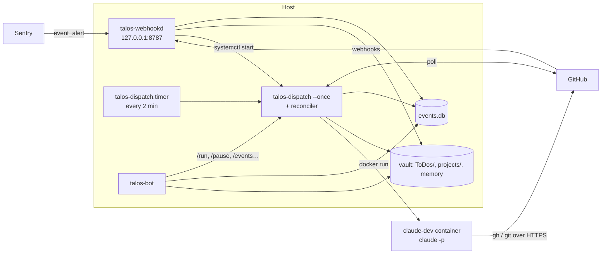

# Architecture

- [Components](#components)
- [Modules](#modules)
- [Pipelines](#pipelines)
- [State on disk](#state-on-disk)
- [The ledger and the work item](#the-ledger-and-the-work-item)
- [The run contract](#the-run-contract)
- [Design decisions and why](#design-decisions-and-why)

## Components



Four processes, all Python, all running from one checkout:

- **`talos-webhookd`** is the HTTP ingress. It verifies signatures, archives the
  raw payload, runs triage, records the verdict in `events.db`, writes a
  brief if the event is admitted, and starts a dispatch pass. It answers in
  milliseconds, because Sentry cuts webhook requests off at about 1 s.
- **`talos-dispatch`** is the worker. A pass takes a flock, reaps dead
  containers and stale rows, runs the reconciler if it's due, then runs
  pending briefs one at a time. It runs from a systemd timer, when
  `webhookd` starts it, from `/run`, or by hand.
- **The reconciler** (`talos-reconcile`, also called inside each dispatch
  pass) polls GitHub for what the webhook missed: new issues, review comments,
  merges, and releases to prod.
- **`talos-bot`** is the Telegram control panel.

## Modules

| Module | Role |
| --- | --- |
| `dispatch.py` | Config loading, brief discovery and ordering, prompt building, `docker run`, result contract, state transitions, caps, Telegram notifications, CLI |
| `webhookd.py` | HTTP server (`/gh`, `/sentry`, `/healthz`), GitHub and Sentry handlers, `open_review_round`, label pre-creation |
| `reconcile.py` | Poll-based admission, review rounds from comments, merge and release detection, `merged_dev` migration, stuck-row notices |
| `triage.py` | Admission gates: backlog cutoff, opt-out label, authors, anti-loop, caps, Sentry level, environment and title filters |
| `store.py` | SQLite ledger (`deliveries`, `events`), dedupe, state changes, reaping orphans |
| `routing.py` | Resolves `owner/repo` and Sentry project slugs to a local project, sub-repo and service path. Validates routing (`python -m talos.routing --validate`) |
| `brief_factory.py` | Builds `issue-fix`, `review-fix` and Sentry briefs, with the untrusted-data fences |
| `feedback.py` | Comments and labels on the source issue, the lifecycle labels, failure notices |
| `worktree.py` | Per-run worktrees, the git config allowlist, host-side git flags, workspace folders |
| `bmad_kit.py` | Detects, installs (pinned `bmad-method`) and syncs the headless overrides |
| `sentry_api.py` | Fetches the Sentry issue and latest event over REST at dispatch time |
| `secrets_env.py` | Loads `~/.orchestrator/secrets.env` and resolves secret names from config |
| `util.py` | Config path (`TALOS_CONFIG`), pause sentinel, slugs, time helpers |
| `bot.py` | Telegram commands and the `/brief` conversation |
| `prompts/` | System prompts: `lead-orchestrator.md` (manual briefs), `lead-issue-fix.md`, `lead-review-fix.md` |
| `bmad-kit/` | `_bmad/custom/` overrides: `bmad-quick-dev.toml`, `bmad-code-review.toml`, `headless-contract.md`, `headless-complete.md` |

Supporting files:

- `docker/` holds the `claude-dev` image.
- `scripts/` holds the operator tools: `events.py`, `replay.py`,
  `runlog.py`, `setup_webhook.py`, `bmad_check.py` and `ingress.sh`.
- `deploy/` holds the systemd units and `run.sh`.
- `.claude/agents/` holds the swarm's subagent definitions.
- `tests/test_offline.py` has the offline tests, with recorded payloads in
  `tests/fixtures/`.

## Pipelines

The `pipeline` field in a brief's front matter picks the system prompt and
the trust level:

| Pipeline | Source | System prompt | Container | Default timeout |
| --- | --- | --- | --- | --- |
| `default` | manual brief | `lead-orchestrator.md` | manual (broad mounts) | `claude_timeout_seconds` |
| `issue-fix` | GitHub issue or Sentry alert | `lead-issue-fix.md` | hardened, worktree | `timeouts.issue-fix` |
| `review-fix` | review threads on a harness PR | `lead-review-fix.md` | hardened, worktree | `timeouts.review-fix` |

An unknown pipeline value falls back to `default`, with a warning.

The lead prompt is rendered with the brief's values and written to
`/workspace/.lead-orchestrator.md`, then passed with
`--append-system-prompt-file`. The container runs:

```text
claude -p <prompt> --append-system-prompt-file /workspace/.lead-orchestrator.md \
  --dangerously-skip-permissions --output-format stream-json --verbose
```

The container runs with `--init` (claude is PID 1, so something has to reap
the zombies left by the agent's Bash calls) and stdin on `/dev/null`. claude
writes straight into dispatch's pipe; there is no pseudo-TTY. A stall watchdog
cuts the run when the log stops growing for `stall_timeout_seconds`.

## State on disk

Everything the harness owns lives in `~/.orchestrator/`:

| Path | What |
| --- | --- |
| `events.db` | The event ledger (SQLite, WAL). **Back it up.** |
| `events/raw/` | Every raw webhook payload, which is the replay corpus |
| `logs/dispatch.log` | The general log (rotated) |
| `logs/runs/<timestamp>-<project>.log` | One stream-json log per run |
| `logs/plans/` | Archived swarm plans (`.orchestrator-plan.md`) |
| `worktrees/<run>` | Per-run git worktrees (deleted when the run ends) |
| `workspaces/<project>` | BMAD workspaces for projects without `subrepo` |
| `agent-home/` | Throwaway `~/.claude` folders for hardened runs |
| `secrets.env` | Secrets, mode 0600 |
| `PAUSED` | The kill switch sentinel |
| `dispatch.lock` | The pass flock |
| `last-reconcile` | Timestamp of the last reconciler pass |

The vault holds the work items and memory:

| Path | What |
| --- | --- |
| `{vault}/ToDos/` | Queue: `pending`, `running`, `failed`, and `draft` (dry run) briefs |
| `{vault}/projects/{project}/completed/` | Finished briefs |
| `{vault}/projects/{project}/skipped/` | Briefs skipped at dispatch time (opt-out label, closed issue, resolved Sentry issue) |
| `{vault}/projects/{project}/dry-run/` | Dry-run drafts archived when a repo goes live |
| `{vault}/{memory_dir}/` | Per-project agent memory |

## The ledger and the work item

The split between the two is deliberate. `events.db` is the **ledger**: what
fired, what the harness decided, and why. The Markdown brief in the vault is
the **work item**. Dispatch never queries the DB to decide what to run. It
uses `status: pending` in the front matter. That keeps the event harness a
small addition on top of the original brief runner. It also means you can
always look at, edit or delete the queue in Obsidian.

The ledger is also the main re-entry guard. The lifecycle labels on GitHub
are the second one, but they only cover issues that already got a PR. If the
DB is lost, the reconciler re-admits everything else after the cutoff.

These are the main event states:

- **`dry_run`**: admitted in a repo in dry-run mode, with a draft brief.
- **`pending`, `running`**: the brief is queued or running.
- **`pr_open`**: stage A opened the PR.
- **`merged_dev`**: merged to the integration branch, waiting for the
  release.
- **`done`**: released, or closed by a human.
- **`failed`**: the run failed. `/retry` requeues it.
- **`orphaned`**: the run died without recording a result, and the reaper
  marked it.
- **`skipped`**: skipped at dispatch time.
- **`brief_error`**: the brief couldn't be written.
- **`rejected_<gate>`**: dropped by triage, with the gate that dropped it.

## The run contract

The agent must write `/workspace/.orchestrator-result.json` before it exits.
The file reports the status (`ok`, `failed`, `aborted_max_iterations`), the
PRs with their URL, branch and commits, a summary, blockers, and review
counts. For `issue-fix` and `review-fix` the PR is load-bearing, so a missing
or unusable result is a failure: `result_contract_violation`. As a fallback,
dispatch looks the PR up by branch.

`claude -p` exits 0 even when the run crashed halfway, so dispatch reads the
final `result` event from the stream to get the real outcome, the turn count
and the cost.

## Design decisions and why

| Decision | Rejected alternative | Reason |
| --- | --- | --- |
| Claude Code headless | Managed Agents API | Reuses a Claude subscription, with no extra per-token cost |
| A custom Python orchestrator | Aperant | Aperant needs a manual UI and isn't really headless |
| Obsidian vault on the host, mounted into Docker | Vault inside the container | Containers are ephemeral, so data has to live on the host |
| Telegram as the control panel | Slack | Personal preference, and the bot is simpler to build |
| `.md` files for memory | MemPalace | Premature optimization. Revisit when there's real volume |
| Docker for execution | A VM with OpenClaw | Less overhead, the same isolation, easier to maintain |
| Two stages (implement + review, then fix) | One agent that reviews and fixes | Every fix commit answers a single thread, and the reviewer's context isn't spent on fixing. Stage B needs its own container anyway, because human comments arrive days later |
| systemd timer plus a kick from `webhookd` | `talos-dispatch --watch` | The flock makes overlapping passes safe, and a crash can't wedge a timer |
| A reconciler that polls GitHub | Relying on webhooks | A dead tunnel or dropped delivery otherwise loses work silently. With the reconciler, the GitHub half needs no ingress |
| Pause stops dispatch, not admission | Pause everything | Events that arrive during a pause would be lost, because the reconciler skips rows it already knows |
| Caps evaluated in dispatch, as a deferral | Caps at admission, as a rejection | A capped brief runs by itself once the cap frees up, with no re-admission |
| Caps apply only to stage A | Caps on both stages | Capping `review-fix` by open PRs would deadlock. Stage B has its own round cap |
| The `activated_at` cutoff is sticky (rejections keep their row) | Re-evaluate rejections | Otherwise the backlog gets in through the back door. `/backfill` is the explicit way in |
| Threshold in the Sentry alert rule (`event_alert`) | Threshold in the harness on `issue.created` | `issue.created` arrives with a count of about 1 and isn't resent, so a harness-side threshold dropped exactly what mattered |
| Sentry context fetched by dispatch | Fetched in the webhook handler | Two REST calls of up to 20 s don't fit in Sentry's ~1 s webhook timeout |
| Per-run worktree created with `--no-checkout` on the host | Run in the user's checkout | Your working tree is never touched, and the host never runs checkout filters or LFS on a repo the container can write |
| `stream-json` run logs | Text output | In text mode `claude -p` prints nothing until the end, so a run that dies after two hours left an empty log |
| No pty, plus a stall watchdog | `script -qfc` wrapper | stream-json already emits one line per event. With stdin on `/dev/null`, `script` sometimes stopped draining the pty, claude blocked on write and the run froze until the pipeline timeout |
| BMAD pinned to 6.10.0 | Latest BMAD | From 6.11 on, `bmad-quick-dev` is a shim that HALTs on the headless override. Migrating to `bmad-build-auto` is planned |
| `--network=host` | The default bridge | Per-uid VPN routing traps the bridge, and the container already shared credentials and the vault, so network isolation was nominal for manual briefs |
| Host credentials mounted read-write for manual briefs | Read-only | Claude Code writes `session-env/` on every start, and a read-only mount breaks the Bash tool |
| Throwaway `~/.claude` for event pipelines | Mounting the host's | A prompt injection could install a hook or MCP server that runs on the host |
